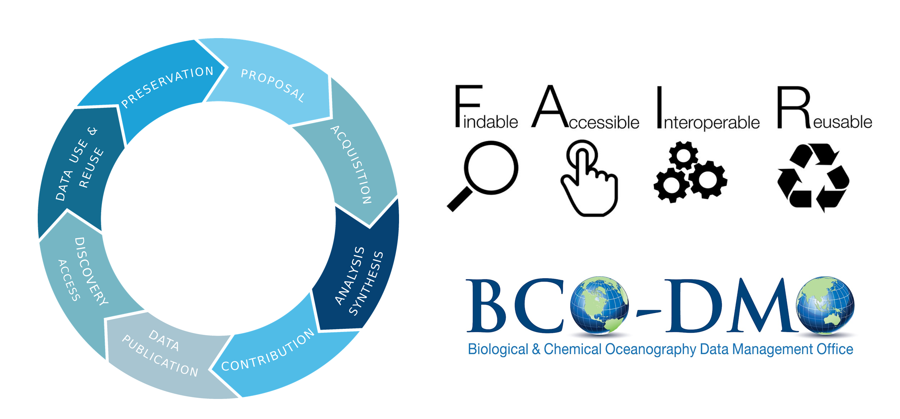

## Deep Dive into Data Management

So far we have tackled the general concepts around data management: F.A.I.R concepts and the data life cycle. And where BCO-DMO fits in that picture. 

F.A.I.R geared toward data curators rather than individual researchers, and to facilitate machine accessibility of data in addition to human readability. But you should endeavor to use resources that help move your data closer to being FAIR. BCO-DMO engages in all of the FAIR principles.

There are steps individual researchers can take to increase the “fairness” of their data. This will be the focus of today. We will dive deeper into hands-on management of data tables and the general practices of (re)using a data table. 

### Part 1: Good approaches to Tabular Data Formatting

Spreadsheets are good for data entry. Therefore we have a lot of data in spreadsheets. Much of your time as a researcher will be spent in this 'data wrangling' stage. It's not the most fun, but it's necessary. We'll teach you how to think about data organization and some practices for more effective data wrangling. After this lesson, you will be able to:
- Implement best practices in data table formatting  
- Identify and address common formatting mistakes
- Understand approaches for handling dates in spreadsheets
- Effectively export data from spreadsheet programs

Table of content:

1. [Tabular Data and Spreadsheets](../01-tabular-data/)
2. [Common formatting mistakes & exercise](../02-format-data/)
3. [Discussion](../03_common-mistakes/)
4. [Dates are special](../04-dates-as-data/)
5. [Exporting data](../05-exporting-data.md/)

### Part 2: Manipulation of F.A.I.R datasets

After this lesson, you will be able to:

- Apply best practices in data table formatting we learned in previous lessons
- Utilize basic quality control features and data manipulation practices
- Perform basic statistical analyses and plotting.
- Effectively export data from spreadsheet programs
- Learn the benefits and drawbacks to analyzing data in spreadsheets.
- Learn about other ways to analyze data other than spreadsheets.

### Content

1. 
2. Assessing metadata
3. Download data
4. Data manipulation in spreadsheets
8. What is Next? 
