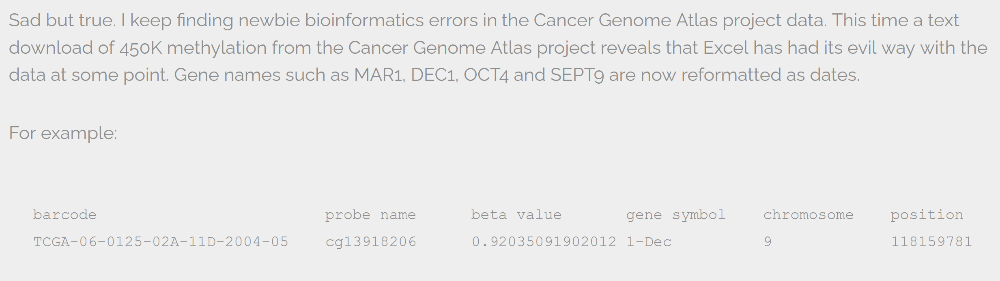
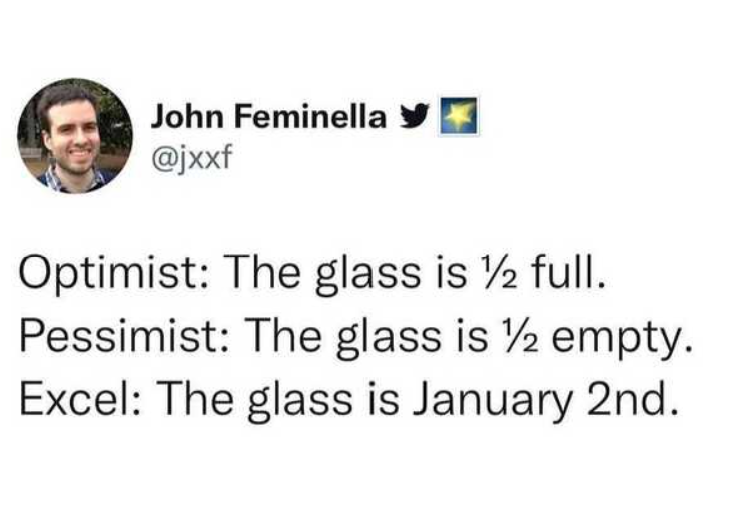
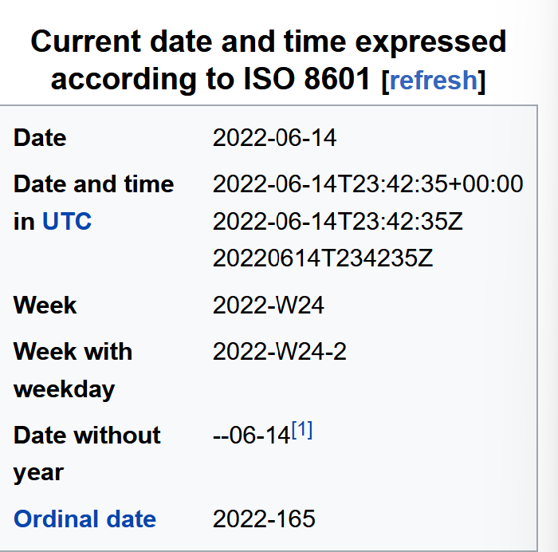
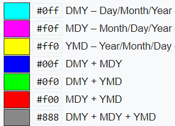

## Dates are finicky

## Dates in Excel
Date formats in excel need special attention. There are many numerous “useful features” which allow them to handle dates in a variety of ways.

There are different ways to visualize a date and as you work on your spreadsheet, the format may change unintentionally due to these features. Example: 

Those visualizations of dates are valid for a given spreadsheet program (be it LibreOffice, Microsoft Excel, OpenOffice, Gnumeric, etc.) are usually guaranteed to be **compatible only within the same family of products**. 

Additionally, Excel can **[turn things that aren't dates into dates](https://nsaunders.wordpress.com/2012/10/22/gene-name-errors-and-excel-lessons-not-learned/)**, for example names or identifiers like MAR1, DEC1, OCT4. So if you're avoiding the date format overall, it's easier to identify these issues. 

## What you see is not what everyone gets...

Behind the scenes excel stores a date as numbers, which allows you to make calculations with dates as well as making plots

Essentially, it counts the days from a default of December 31, 1899, and thus stores July 2, 2014 as  the **serial number** 41822.

This serial number thing can actually be useful in some circumstances. By using the above functions we can easily add days, months or years to a given date. Say you had a sampling plan where you needed to sample every thirty seven days. In another cell, you could type:

 July 2, 2014 = 41822

    =B2+37

And it would return

    8-Aug

because it understands the date as a number `41822`, and `41822 + 37 = 41859` which Excel interprets as August 8, 2014. 

Take home message working with excel dates: 

All excel cells have a value in them that have a format on top of them which is what you see. This has implications when you want to share your data. 

* When you open a file in excel, it sometimes tries to interpret data as dates, sometimes it interprets the wrong format. 
* When opening excel files in other programs, that program might not interpret the format correctly. For example, opening an excel file in python will show the integer/number value of that cell, rather than the date. 

## Best Practices in Notation?

There are several solutions to get these date problems. Which one you use depends on the way that you are using dates. We will go through several options that are good for analysis and data reuse purposes. 

While there are standards for dates, communities often have common conventions they use, and some software may require a specific format.  It may be easier to analyze data in some formats than others.  In some situtations you may need a date in one format during analysis, and then change it to another when you prepare your final data for preservation and archiving.

Whatever the format you decide to use, it is important that you document your format.  It is a best practice to use one date format per data column.

## Preferred date format

It is much safer to store dates with [YEAR, MONTH, DAY](#day) in separate columns or as [YEAR and DAY-OF-YEAR](#doy) in separate columns.

**Note**: Excel is unable to parse dates from before 1899-12-31, and will thus leave these untouched.  If you’re mixing historic data from before and after this date, Excel will translate only the post-1900 dates into its internal format, thus resulting in mixed data. If you’re working with historic data, be extremely careful with your dates!

Excel also entertains a second date system, the 1904 date system, as the default in Excel for Macintosh. This system will assign a different serial number than the [1900 date system](https://support.microsoft.com/en-us/help/214330/differences-between-the-1900-and-the-1904-date-system-in-excel). Because of this, [dates must be checked for accuracy when exporting data from Excel](http://uc3.cdlib.org/2014/04/09/abandon-all-hope-ye-who-enter-dates-in-excel/) (look for dates that are ~4 years off). 

### Advantages of Alternative Date Formatting

###  Storing dates as YEAR, MONTH, DAY

Storing dates in YEAR, MONTH, DAY format helps remove this ambiguity. Let's look at this issue a bit closer.

For instance this is a spreadsheet representing insect counts that were taken every few days over the summer, and things went something like this:

If Excel was to be believed, this person had been collecting bugs **in the future**. Now, we have no doubt this person is highly capable, but I believe time travel was beyond even their grasp.

Entering dates in one cell is helpful but due to the fact that the spreadsheet programs may interpret and save the data in different ways (doing that somewhat behind the scenes), there is a better practice.  

In dealing with dates in spreadsheets, separate date data into separate fields (day, month, year), which will eliminate any chance ofambiguity. 

### Storing dates as YEAR, DAY-OF-YEAR

There is also another option. You can also store dates as year and day of year (DOY). Why? Because depending on your
question, this might be what's useful to you, and there is practically no possibility for ambiguity creeping in.

Statistical models often incorporate year as a factor, or a categorical variable, rather than a numeric variable, to account for 
year-to-year variation, and DOY can be used to measure the passage of time within a year. 

So, can you convert all your dates into DOY format? Well, in Excel, here’s a useful guide:

###  Storing dates as a single string

Another alternative could be to convert the date string
into a single string using the `YYYYMMDDhhmmss` format.
For example the date `March 24, 2015 17:25:35` would
become `20150324172535`, where:

YYYY:   the full year, i.e. 2015  
MM:     the month, i.e. 03  
DD:     the day of month, i.e. 24  
hh:     hour of day, i.e. 17  
mm:     minutes, i.e. 25  
ss:     seconds, i.e. 35  

Such strings will be correctly sorted in ascending or descending order, and by
knowing the format they can then be correctly processed by the receiving
software.

## ISO 8601 Standard

ISO 8601 is an international standard covering the communication of date and time related data. (Source wikipedia)

Standards in date and time notation are very important. For example the todays date June 15, 2022 is written in America as 06/15/22, while in Canada it is written as 15/06/2022. 

## Whatever format you decide to use, document it

Documenting the format you use is very important.  If you share your data in Excel or another program, the person recieving your data can verify what they see is what you intended if you write down the format.

> Example: Ambiguous dates
> 
> You have a date in your dataset **11/4/12**.
> If you are in America you may assume this is **November 4th, 2012**.
> If you are in Europe you may assume this is **April 11th, 2012**.
> If you are in Japan you may assume this is **April 12th, 2011**
>
> To be FAIR you have to think globally.  How do you make sure everyone can understand your data?  Describe it!
>
> 
> * image by Artem Karimov, TopoChecker (2019-04-09) [Date_format_by_country_NEW.svg,part of WikiProject Time](https://commons.wikimedia.org/wiki/File:Date_format_by_country_NEW.svg)
> 
