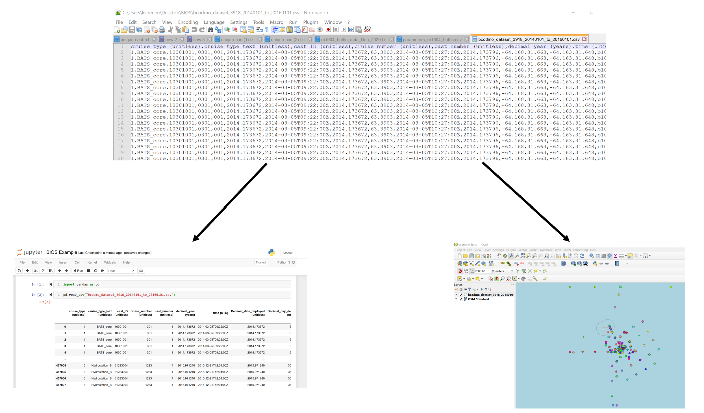

### Exporting data files

Storing the data you're going to work with for your analyses in Excel default file format (`*.xls` or `*.xlsx` - depending on the Excel version) isn't a good idea. Why?

- Because it is a proprietary format, and it is possible that in the future, technology won’t exist (or will become sufficiently rare) to make it inconvenient, if not impossible, to open the file.
  
- Other spreadsheet software may not be able to open files saved in a proprietary Excel format.
  
- Different versions of Excel may handle data differently, leading to inconsistencies.
  
- Finally, more journals and grant agencies are requiring you to deposit your data in a data repository, and most of them don't accept Excel format. It needs to be in one of the formats discussed below.
  
- The above points also apply to other formats such as open data formats used by LibreOffice / Open Office. These formats are not static and do not get parsed the same way by different software packages.

As an example of inconsistencies in data storage, do you remember how we talked about how Excel stores dates earlier? It turns out that  there are **multiple defaults for dates for different versions of the Excel software**, and you can switch between them all. So, say you’re compiling Excel-stored data from multiple sources. There are dates in each file - Excel interprets them as their own internally consistent serial numbers. When you combine the data, Excel will take the serial number from the place you’re importing it from, and interpret it using the rule set for the version of Excel you’re using. Essentially, you could be adding errors to your data, and it wouldn’t necessarily be flagged by any data cleaning methods if your ranges overlap.

### The CSV format

Storing data in a universal, open, and static format will help deal with this problem. Try tab-delimited (tab separated values or TSV) or comma-delimited (comma separated values or CSV). CSV files are **plain text files** where the **columns are separated by commas**, hence 'comma separated values' or CSV. 

The advantage of a CSV file over an Excel/SPSS/etc. file is that we can open and read a CSV file using just about any software, including plain text editors like TextEdit or NotePad.  Data in a CSV file can also be easily imported into other formats and environments, such as SQLite, R, Python and QGIS. We're not tied to a certain version of a certain expensive program when we work with CSV files, so it's a good format to work with for maximum portability and endurance. 

Most spreadsheet programs can save to delimited text formats like CSV easily, although they may give you a warning during the file export.

To save a file you have opened in Excel in CSV format:

1. From the top menu select 'File' and 'Save as'.
2. In the 'Format' field, from the list, select 'Comma Separated Values' (`*.csv`).
3. Double check the file name and the location where you want to save it and hit 'Save'.

An important note for backwards compatibility: you can open CSV files in Excel!

### Dealing with comma's

---
When talking about exporting data we discussed how to export Excel file formats into `csv`. Comma Separated Value files are indeed very useful and allow for easily exchanging and sharing data. 

However, there are some significant problems with this particular format. Quite often the **data values themselves may include commas (,)**. In that case, the software which you use (including Excel) will most likely incorrectly display the data in columns. This is because the commas which are a part of the data values will be interpreted as delimiters.

For example, our data might look like this:	

		species_id,genus,species,taxa
		AB,Amphispiza,bilineata,Bird
		AH,Ammospermophilus,harrisi,Rodent-not,censused
		AS,Ammodramus,savannarum,Bird
		BA,Baiomys,taylori,Rodent

In the record `AH,Ammospermophilus,harrisi,Rodent-not,censused` the value for `taxa` includes a comma (`Rodent-not,censused`). 
If we try to read the above into Excel (or other spreadsheet program), we will get something like this:

The value for `taxa` was split into two columns (instead of being put in one column `D`). This can propagate to a number of further errors. For example, the extra column will be interpreted as a column with many missing values (and without a proper header). In addition to that, the value in column `D` for the record in row 3 (so the one where the value for 'taxa' contained the comma) is now incorrect. 

If you want to store your data in `csv` format and expect that your data values may contain commas, you can avoid the problem discussed above by putting the values in quotes (""). Applying this rule, our data might look like this:

	species_id,genus,species,taxa
	"AB","Amphispiza","bilineata","Bird"
	"AH","Ammospermophilus","harrisi","Rodent-not, censused"
	"AS","Ammodramus","savannarum","Bird"
	"BA","Baiomys","taylori","Rodent"

Now opening this file as a `csv` in Excel will not lead to an extra column, because Excel will only use commas that fall outside of quotation marks as delimiting characters. However, if you are working with an already existing dataset in which the data values are not included in "" but which have commas as both delimiters and parts of data values, you are potentially facing a major problem with data cleaning.

If the dataset you're dealing with contains hundreds or thousands of records, cleaning them up manually (by either removing commas from the data values or putting the values into quotes - "") is not only going to take hours and hours but may potentially end up with you accidentally introducing many errors.

Cleaning up datasets is one of the major problems in many scientific disciplines. The approach almost always depends on the particular context. However, it is a good practice to **clean the data in an automated fashion**, for example by writing and running a script. The Python and R lessons will give you the basis for developing skills to build relevant scripts.

