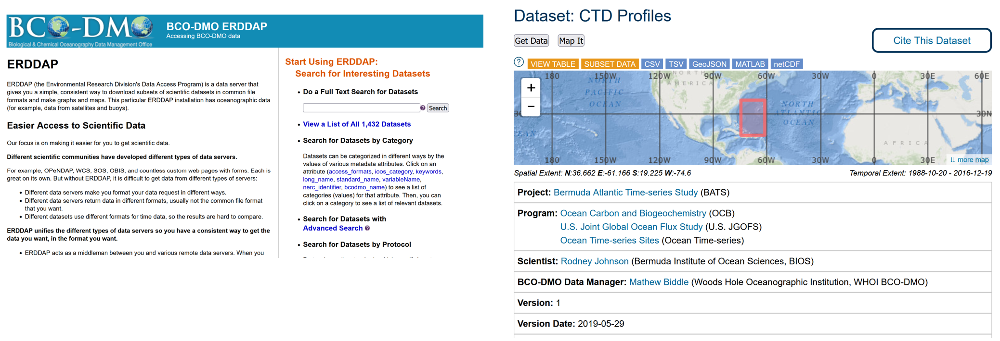
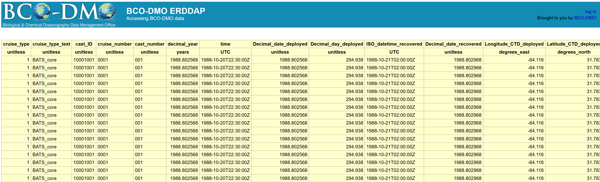
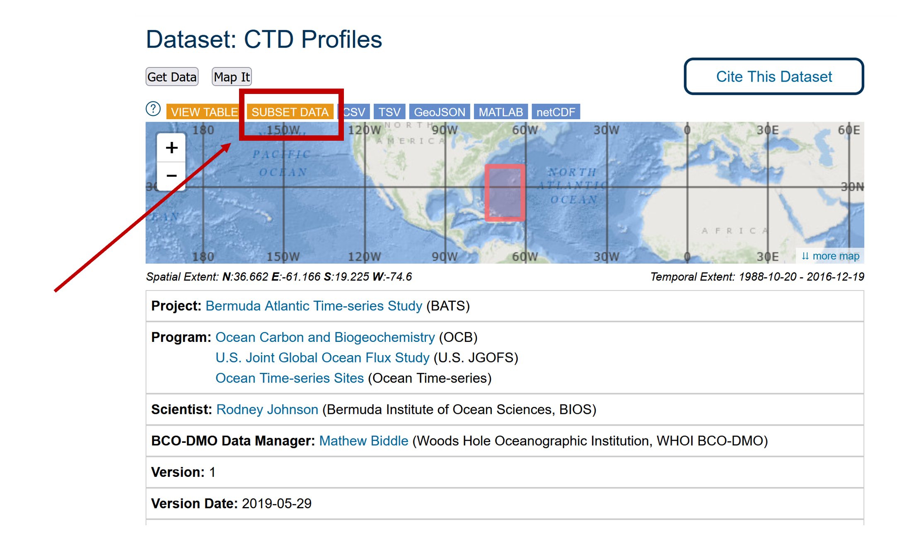
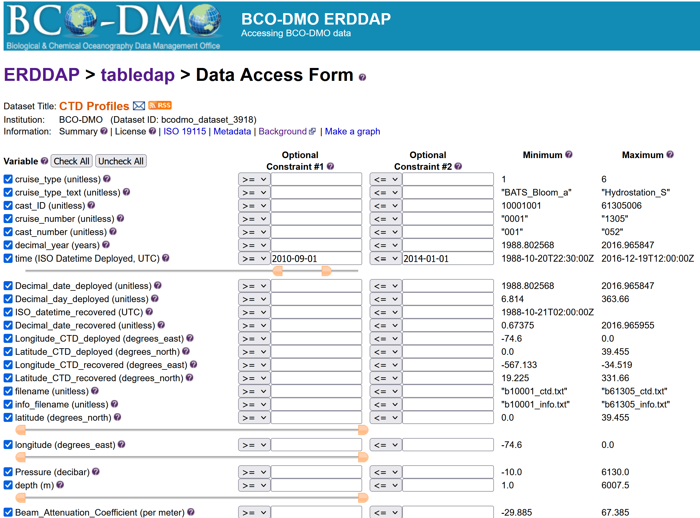

### What is ERDDAP?

When scientists make their data available online for people to re-use  it, there can often still be barriers that stand in the way of easily  doing so. Reusing data from another source is difficult:

- different way of requesting data
- different formats: you work with R while colleague is working with Matlab and the other one with python
- Need for standardised metadata

**This is where ERDDAP comes in.** It gives data  providers the ability to, in a consistent way, download  subsets of  gridded and tabular scientific datasets in common file formats and make  graphs and maps.

There is no “1 ERDDAP server”, instead organisations and repositories  have their own erddap server to distribute data to end users. These  users can request data and get data out in various file formats.  Many  institutes, repo’s and organizations (including [NOAA](https://coastwatch.pfeg.noaa.gov/erddap/index.html), [NASA](https://podaac-uat.jpl.nasa.gov/erddap/index.html), and [USGS](https://geoport.usgs.esipfed.org/erddap/index.html)) run ERDDAP servers  to serve their data.

BCO-DMO has its own erddap server that is continuously being updated. We added ERDDAP badges to make it easy for new users to grab the dataset in the format they need.

## Downloading a Dataset

Previously we covered some ways you can [access data from the ERDDAP server](../08_erddap_catalog_search/index.html), but you can also download a whole dataset from the Dataset Metadata Page itself. There are buttons to easily download data in many file formats.

You can click the `CSV` button to download the data table in csv-format.  You can then open it in the editor of your choice. Below is what it looks like in Excel.

- "Understand all the different factors for reusing online data with ERDDAP"
keypoints:
- "Searching an ERDDAP data catalog can be done using a web page"
- "Data can be downloaded in different file formats"
- "Constraints can be added to a dataset search"

## Downloading Data

For this example, we'll zoom in on the BATS CTD dataset that BCO-DMO is serving. The dataset landing page can be found here: [https://www.bco-dmo.org/dataset/3918](https://www.bco-dmo.org/dataset/3918)

This dataset has data from 1988 to 2016, so it is a very big dataset. Clicking on the "view table" button will try to pull up the data table, but it is very big and not easily to pull up and to download.

**Subsetting a dataset in ERDDAP**

An easier way to download the data is to subset it. Which means taking a slice of the dataset that you are interested in particulary.

