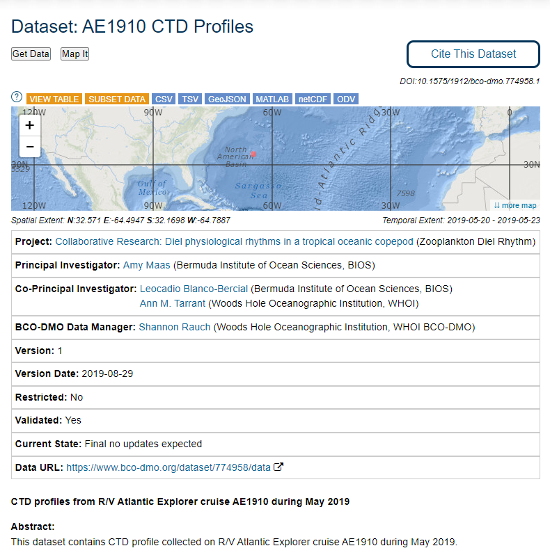
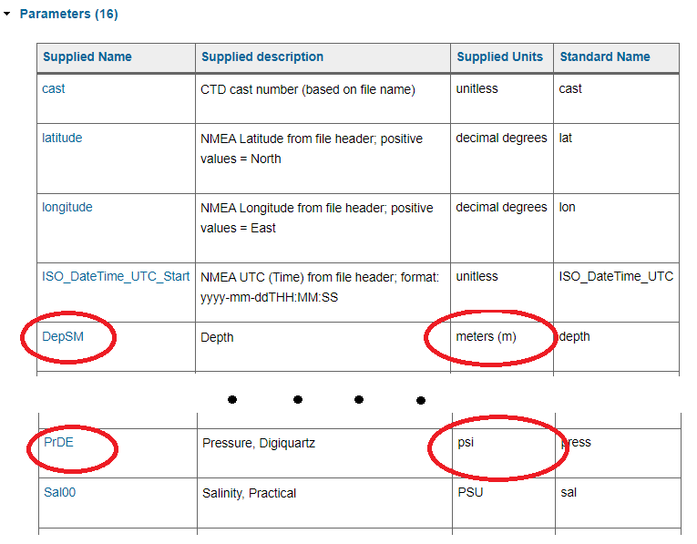
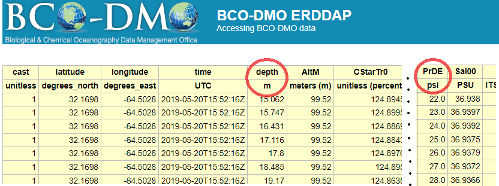
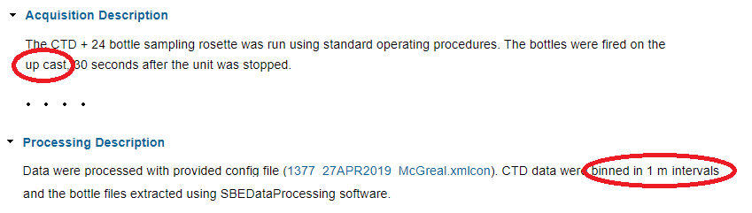
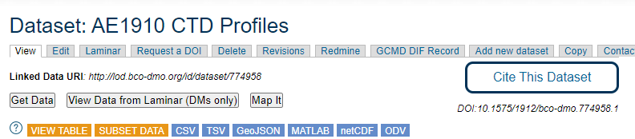
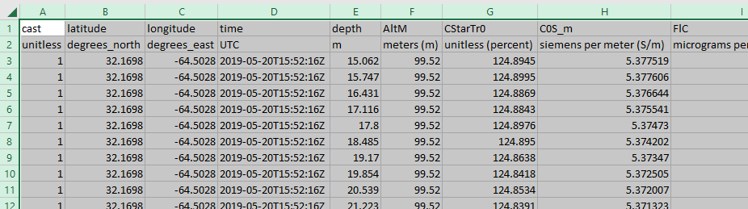

### Assessing a Dataset

Let's take a look at an example Dataset Metadata Page at BCO-DMO. 

**Dataset: AE1910 CTD Profiles**: [https://www.bco-dmo.org/dataset/774958](https://www.bco-dmo.org/dataset/774958)

## Reviewing the metadata

Does the metadata include important context for using these data?  Does it indicate anything about the data quality? Is it preliminary or final?

Can you find information about what is in each data column?  What are the units?

> ## Exercise: Finding units
>
> Go to **Dataset: AE1910 CTD Profiles**: [https://www.bco-dmo.org/dataset/774958](https://www.bco-dmo.org/dataset/774958) which serves a data table.  
>
> Can you find which column(s) contain information about how deep the measurements were taken?
>
> What are the column(s) names?  
> 
> What are the units?
>
> > ## Solution
> > In the section called** "Parameters" **has this information.
> >
> > 
> > 
> > You can also see this information by viewing the data table with the button:   However since you don't have descriptions of the columns here, it is best to get the information from the "Parameters" section as shown above.
> > 
> > 
> > 
> > {: .output}
> {: .solution}
{: .challenge}

> ## Exercise: Looking at methods to understand your data
>
> Go to **Dataset: AE1910 CTD Profiles**: [https://www.bco-dmo.org/dataset/774958](https://www.bco-dmo.org/dataset/774958) 
>
> **Challenge question 1: What part of the cast is in this dataset?**
> 
> These are CTD profiles (AKA "casts") which are deployed over the side of a ship, go down through the water column, and back up again.  We need to know which part of the profile we are working with.  We could have data from the entire profile (up and down casts), or just the up cast, or just the downcast.
> 
> What part of the cast is in this dataset?
>
> **Challenge question 2: Raw or Processed?**
> 
> It's also important to know whether we are working with raw data directly off of an instrument, or whether it went through any processing.  For CTD data it is standard to perform processing so we want to make sure we are working with processed not raw data.  
> >  Processing can include error correction, grouping data together by depth (AKA "binning"), and calculating new parameters (salinity and density can be calculated from temperature and conductivity).
> 
> What does the metadata say? Raw or processed data?
>
> > ## Solution
> > In the section called `Acquisition description` it says these data are from the up cast (not the down cast).  In the section called `Processing Description` it says these data were processed and binned to 1-meter intervals.  This means that when we look at the data table we should see a row of data per meter.
> >
> > 
> > 
> > {: .output}
> {: .solution}
{: .challenge}

## Downloading a Dataset

Previously we covered some ways you can [access data from the ERDDAP server](../08_erddap_catalog_search/index.html), but you can also download a whole dataset from the Dataset Metadata Page itself. There are buttons to easily download data in many file formats.

You can click the `CSV` button to download the data table in csv-format.  You can then open it in the editor of your choice. Below is what it looks like in Excel.

